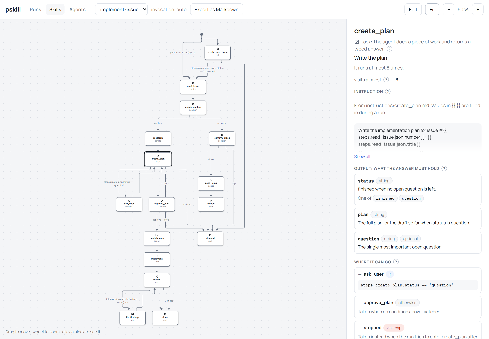

# pskill

**Run agent skills as programs, not as long text.** A normal skill is a text file that asks your coding agent (Claude Code, Codex, and others) to follow some steps. A pskill skill is a map of steps, and a small program (the **runner**) gives the agent one step at a time. The agent cannot skip a step or change the order.



*The example skill `implement-issue` in the viewer. Each box is one step, and the arrows show where each step can go next.*

## Why

Agents often skip a step of a long skill, forget a value, or jump ahead. With pskill, the runner keeps the order and the values. The agent only does the current step.

## How it works

1. You ask your agent for a task, for example "implement issue 42".
2. The agent starts the matching skill. One use of a skill is a **run**.
3. The runner gives the agent one step. The agent does it and sends back its answer.
4. The runner checks the answer and gives the next step. If the answer is incomplete, the agent must fix it.
5. This repeats until the skill ends. When a step needs your decision, the agent asks you.

## Requirements

- [uv](https://docs.astral.sh/uv/), a small tool that installs everything else (Python included).
- git. The example skills also use the [GitHub CLI](https://cli.github.com/) (`gh`).

## Install

In the main folder of your project, run:

```bash
uv run https://raw.githubusercontent.com/guplem/pskill/main/pskill.py init
```

This creates a small `.pskill/` folder. Commit it to git. Its file `pskill.py` names the pskill version. The first time someone runs it, it downloads that version once, so your teammates install nothing.

To move to the newest version later (this changes one line in `.pskill/pskill.py`):

```bash
uv run .pskill/pskill.py update
```

## What pskill adds to your project

- **One small file per skill** (`SKILL.md` in `.claude/skills/` and `.agents/skills/`). Your agent finds the skill through it. It holds the skill's goal and tells the agent how to use the runner.
- **Two hooks** (commands that your agent app runs by itself):
  - When the agent tries to stop while a step is still open, the hook tells it to continue. After 3 tries, it lets the agent stop and pauses the run.
  - When you open a session, the hook updates the small skill files.
- **One permission rule**, so your agent app does not ask you each time the agent talks to the runner. It allows only `uv run .pskill/pskill.py ...`.

Claude Code and Codex use the hooks only after you trust the project folder. Codex also asks you once to approve each hook (type `/hooks`). If your project builds its settings files with its own script, set `hook_files` in `.pskill/config.yaml`.

## Use

Ask your agent for the task. The skill starts by itself. Answer its questions.

You can also use the runner yourself. Each command starts with `uv run .pskill/pskill.py`:

| Command | What it does |
|---|---|
| `list` | List the skills. |
| `start <skill> --input name=value` | Start a skill. Add `--mode autonomous` so the agent decides alone, with no questions. |
| `runs --open` | List the unfinished runs. |
| `current <run>` | Show the current step of a run. |
| `task <run> <n>` | Show the full prompt of one parallel task. A subagent runs this first. |
| `pause <run>`, `resume <run>`, `cancel <run>` | Pause, continue, or stop a run. A run survives when you close the session. |
| `delete <run>` | Delete a finished run, for cleanup. |
| `view` | Open the viewer in your browser (below). |
| `validate` | Check the skills for mistakes. |
| `test` | Run the skills' test cases with recorded answers. No AI model runs. |
| `sync` | Update the small skill files, the hooks, and the permission rule. |

**The viewer** shows each skill as a graph of steps, and each run as the path that it took. Click a step to see its details. You can edit skills and agents there, replay a run step by step, cancel a run, and delete finished runs.

**The hosted viewer** shows the same screens without a command, for many projects at once: open [guplem.github.io/pskill](https://guplem.github.io/pskill/) in Chrome or Edge, and pick your project folders on the Folders tab. A folder of clones and worktrees works too: the viewer finds each project in it, and names the folder and the branch of every run. Your files stay on your computer.

## Write a skill

Read [`AUTHORING.md`](AUTHORING.md), or run `uv run .pskill/pskill.py authoring`. The skills in [`.pskill/skills/`](.pskill/skills/) are working examples.

## Which agent apps work

| Agent app | What works |
|---|---|
| Claude Code | Everything. |
| Codex | Everything, with "Full access" (see below). |
| Others (Gemini CLI, Cursor, ...) | The basics. There are no hooks, so the agent can stop halfway. Parallel tasks run one after another, so each task sees the earlier ones. |

## Know before you use it

- **Autonomous mode asks you nothing.** The agent also takes decisions that normally need you, like "close this issue". Only your agent app's permission settings protect you then.
- **Codex needs "Full access".** Its sandbox (the area that limits what commands can do) stops the runner from sending answers. Choose "Full access" in Codex's permissions menu, or start it with `codex --sandbox danger-full-access`. This turns off the sandbox for every command, not only for pskill.
- **One session per folder, in apps other than Claude Code and Codex.** There, two sessions in the same folder share the hooks.
- **pskill trusts the agent** when it says that you answered a question.
- **The steps are plain files.** The agent could read the later steps. This is not a security barrier.

## Problems

- **The skill does not start:** run `uv run .pskill/pskill.py sync`, then open a new session.
- **You lost a run:** run `runs --open`, then `current <run>`.
- **A run is paused:** the message says why. Fix the cause, then run `resume <run>`.
- **`update` refuses to run:** someone edited a runner file by hand. Undo it, or run `update --force`.

## Develop pskill

See [`AGENTS.md`](AGENTS.md) and the full design in [`SPEC.md`](SPEC.md).

## License

MIT. See [`LICENSE`](LICENSE).
